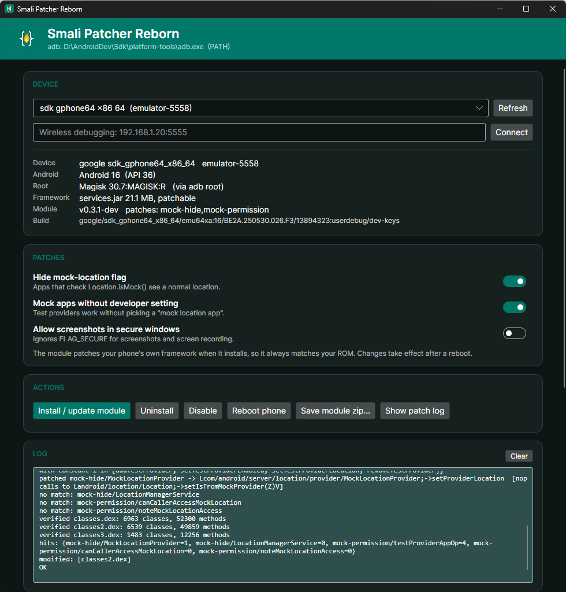

# Smali Patcher Reborn

Patch your phone's own Android framework **on the phone**, as a Magisk / KernelSU / APatch module, for **Android 10 to 17**.

A desktop app (Windows, Linux, macOS) installs and manages it. The module can also be flashed on its own with no PC.

> **Status: 0.3.0-dev, early release.** Tested on Android emulators and on two physical phones (below). Read [Safety](#safety) first.



*The desktop app on an Android 16 emulator: device details, patch switches, one-click install and the patch log.*

## What it does

Smali Patcher Reborn edits `services.jar` (the system server) on your device at install time, so the patch always matches your exact ROM. The original jar is never modified: the patched copy is overlaid by the root manager.

| Patch | Effect |
|---|---|
| **Hide mock-location flag** | Locations from mock providers are not flagged (`Location.isMock()` stays `false`). |
| **Mock apps without developer setting** | Test providers work without selecting a "mock location app". |
| **Allow screenshots in secure windows** | `FLAG_SECURE` no longer blocks screenshots or screen recording. |

## Supported versions

### Tested on real phones

Tested by the maintainer (saadnahid7), installing the module from the root manager app and from the **Windows desktop app**. The **Linux app** (Ubuntu 24.04) was tested against the OnePlus over wireless adb (status), and against an Android 16 emulator for the full cycle: install, reboot, active, uninstall, plus manual jar patching.

| Phone | ROM | Android | Root |
|---|---|---|---|
| Xiaomi Poco X3 Pro | crDroid | 15 | Magisk 31 |
| OnePlus 12R | OxygenOS | 16 | KernelSU 3.3 |

### Emulators (Google APIs images, Magisk 30.7)

Every patch step is matched by class and method **descriptors** (not text), and the build fails loudly if a required patch matches nothing on your ROM.

| Android | API | Install and boot | Mock hidden | Secure window captured |
|---|---|---|---|---|
| 17 | 37 | ✅ | ✅ | ✅ |
| 16 | 36 | ✅ | ✅ | ✅ |
| 15 | 35 | ✅ | ✅ | ✅ |
| 14 | 34 | ✅ | ✅ | ✅ |
| 13 | 33 | ✅ | ✅ | ✅ |
| 12 | 31 | ✅ | ✅ | ✅ |
| 11 | 30 | ✅ | not testable (no shell test-provider command) | ✅ |
| 10 | 29 | patches a real `services.jar` on the PC; not device-tested | – | – |
| 9 and older | ≤ 28 | ❌ not supported | | |

ROMs that ship a *stripped* `services.jar` (code only in odex/vdex) are not supported yet; the installer detects this and changes nothing.

## Quick start

### With the desktop app (recommended)

1. Download the app for your system from **Releases**.
2. Enable USB debugging (or Wireless debugging and use **Connect**), and allow root for the shell in your root manager.
3. Pick your device, choose patches, press **Install / update module**, then reboot.

The app is a single file. It uses the `adb` already on your PC, otherwise a built-in copy.
With several devices connected, nothing is read until you choose one.

#### Running the app

| System | What to do |
|---|---|
| **Windows** | Double-click `SmaliPatcherReborn-windows-x64.exe`. The file is not code-signed, so Windows SmartScreen may warn: choose **More info**, then **Run anyway**. |
| **Linux** | Download `SmaliPatcherReborn-linux-x64.tar.gz`, then in a terminal: `tar xzf SmaliPatcherReborn-linux-x64.tar.gz` and `./SmaliPatcherReborn-linux-x64/SmaliPatcherReborn`. The archive keeps the executable permission, so no `chmod` is needed. (If you downloaded the plain `SmaliPatcherReborn-linux-x64` file instead, run `chmod +x` on it first.) On a minimal install you may also need `sudo apt install libice6 libsm6 libfontconfig1 libx11-6`. |
| **macOS** *(untested)* | Download the `.tar.gz` that matches your Mac (`arm64` for Apple silicon, `x64` for Intel) and extract it (double-click, or `tar xzf <file>`). In Terminal, inside the extracted folder: `xattr -dr com.apple.quarantine .` then `./SmaliPatcherReborn`. I have no Mac to test on, so please report what happens. |

Every system also has a command-line mode: run the file with `help`.

### Manual jar patch (no phone connected)

Copy `system/framework` (or just `services.jar`) off a phone, then use **Manual jar patch** in the app: pick the folder or file, choose the Android version (auto-detected when a `build.prop` is next to it) and press **Patch and build module**. A ready-to-flash module is written **into the same folder**.

```
SmaliPatcherReborn manual --in <system/framework or services.jar> [--api 34] [--patches mock-hide,mock-permission]
```

The module stores the SHA-256 of the original jar and **refuses to install on a phone with a different `services.jar`**, so a module made for another ROM or build can't be flashed by mistake. This mode needs Java 17+ on your computer (the on-device modes don't).

### Phone only

Flash `SmaliPatcherReborn-module-*.zip` in Magisk, KernelSU or APatch. Volume keys pick patches (Vol+ yes, Vol− no, 10 s timeout keeps the default). To skip the menu, create `/data/adb/smalipatcher/patches.conf`:

```
mock-hide=1
mock-permission=1
secure-flag=0
```

A WebUI in the module page lets you change patches later ("Save & re-patch").

### Command line

```
SmaliPatcherReborn devices
SmaliPatcherReborn status  --serial <id>
SmaliPatcherReborn install --serial <id> --patches mock-hide,mock-permission --reboot
SmaliPatcherReborn uninstall --serial <id>
SmaliPatcherReborn export module.zip
```

## Safety

- This modifies a system component. **Make a backup** and know how to recover before flashing.
- If the phone fails to finish booting three times in a row, the module disables itself.
- After a ROM update it disables itself until you re-patch (the patched jar only matches the build it was made on).
- Uninstall from the app, or remove the module in your root manager. Magisk safe mode also works.
- Mock-location and screenshot patches can violate the terms of some apps and games. Use them on your own devices and accounts, at your own risk.

## How it works

```
 desktop app / module zip
        │  (adb push + root manager installs the module)
        ▼
 customize.sh ──► app_process ──► engine.jar (dexlib2, runs on the phone's own ART)
        │                              reads /system/framework/services.jar
        │                              edits methods by descriptor, verifies the result
        ▼
 module overlay:  system/framework/services.jar   (patched copy)
                  + empty placeholders for the stale odex/vdex/prof
 post-fs-data.sh: boot-loop guard, ROM-update guard, clears stale compiled code
```

Compared with the older tools it replaces apktool and regex-on-smali with a descriptor-based dexlib2 engine, works with dex containers from Android 15/16/17, keeps every non-dex jar entry byte-identical, and needs no PC-side Java.

## Build from source

Requirements: JDK 17+ (`JAVA_HOME`), Android SDK with build-tools (`ANDROID_HOME`), .NET 8 SDK, PowerShell.

```powershell
# 1. the module (engine + scripts)
cd reborn
scripts\fetch-libs.ps1
scripts\pcjar.ps1                # JVM engine used by manual jar patching
scripts\dex.ps1
scripts\make-module.ps1          # -> build\SmaliPatcherReborn-<version>.zip

# 2. the desktop app (embeds the module and Google's platform-tools)
cd ..\app
.\fetch-assets.ps1
.\publish.ps1 -Rids win-x64,linux-x64,osx-arm64,osx-x64
```

Layout: `update.json` module update feed, `reborn/src` engine, `reborn/module` Magisk/KSU/APatch module + WebUI, `reborn/testapp` FLAG_SECURE test app, `app` Avalonia desktop app.

## Roadmap

- Stripped-jar support (extract code from odex/vdex), also for manual mode
- KernelSU / APatch re-patch without the original jar mirror
- Optional patches: reboot-to-recovery in power menu, high-volume warning, hide the mock-app developer setting, screen-recording detection callbacks
- Physical-device and KernelSU/APatch verification

## Credits and thanks

- **[fOmey](https://xdaforums.com/t/module-smali-patcher-7-4.3680053/)** – created the original **Smali Patcher** and the idea of patching the framework from the device itself.
- **[sabpprook](https://xdaforums.com/t/module-smalipatcherex-1-2-2.4627905/)** – carried it forward as **SmaliPatcherEx**, adding mock-location support for Android 11 – 14.
- Built on [smali/dexlib2](https://github.com/google/smali) and [Avalonia](https://avaloniaui.net/).
- Icon and colour theme follow SmaliPatcherEx (the XDA Developers logo is XDA's).

Smali Patcher Reborn is a new implementation, maintained by **[saadnahid7](https://github.com/saadnahid7)** · [droidrooter.com](https://droidrooter.com).

## License

[MIT](LICENSE) for the code in this repository. No affiliation with XDA Developers, fOmey or sabpprook.
